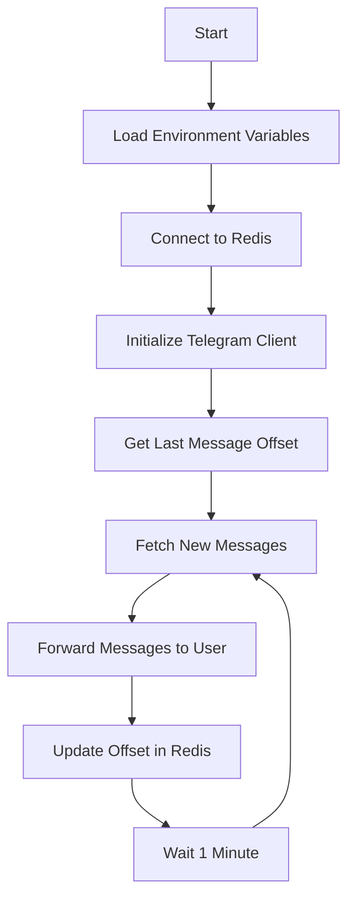

# TeleFW (Telegram Forward Bot)

A Python-based Telegram bot that automatically forwards messages from a specified channel to a designated user. The bot maintains state using Redis to track the last forwarded message, ensuring no duplicates are sent.

## Features

- Automatic message forwarding from channel to user
- Redis-based state management for tracking message offsets
- Timezone-aware message timestamps
- Minute-by-minute scheduled checks for new messages
- Support for large message batches (up to 2000 messages per check)

## Prerequisites

- Python 3.6+
- Redis server
- Telegram API credentials
- Access to the source channel and target user

## Installation

1. Clone the repository:
```bash
git clone https://github.com/yourusername/TeleFW.git
cd TeleFW
```

2. Install dependencies:
```bash
pip install -r requirements.txt
```

3. Copy the environment example file and configure your settings:
```bash
cp env-example .env
```

## Configuration

Edit the `.env` file with your settings:

```env
# Telegram Configuration
API_ID=your_api_id
API_HASH=your_api_hash
CHANNEL_ID=source_channel_id
RECEIVER_ID=target_user_id
STRING_SESSION=your_session_string

# Redis Configuration
REDIS_HOST=localhost
REDIS_PORT=6379
REDIS_PASS=your_redis_password

# Timezone Setting
TZ=Asia/Ho_Chi_Minh
```

### Getting Telegram Credentials

1. Get your `API_ID` and `API_HASH` from [my.telegram.org](https://my.telegram.org)
2. Generate a STRING_SESSION using the provided script:
```bash
python get_session_string.py
```

## Usage

1. Start the bot:
```bash
python main.py
```

The bot will:
- Check for new messages every minute
- Forward messages with timestamps to the target user
- Log operations to `runtime.log`

## Docker Support

Build and run using Docker:

```bash
docker build -t telefw .
docker run -d --name telefw telefw
```

## Project Structure

```
TeleFW/
├── main.py              # Main bot logic
├── get_session_string.py# Session string generator
├── requirements.txt     # Python dependencies
├── env-example         # Environment variables template
├── Dockerfile          # Docker configuration
└── README.md           # Documentation
```

## Flow Diagram



## License

This project is licensed under the MIT License - see the LICENSE file for details.

## Author

Toan Vo <thien@toan.tech>
